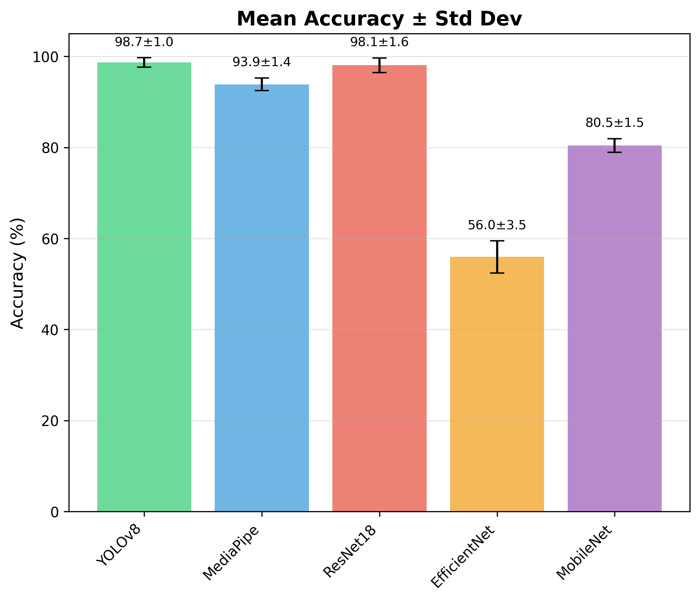
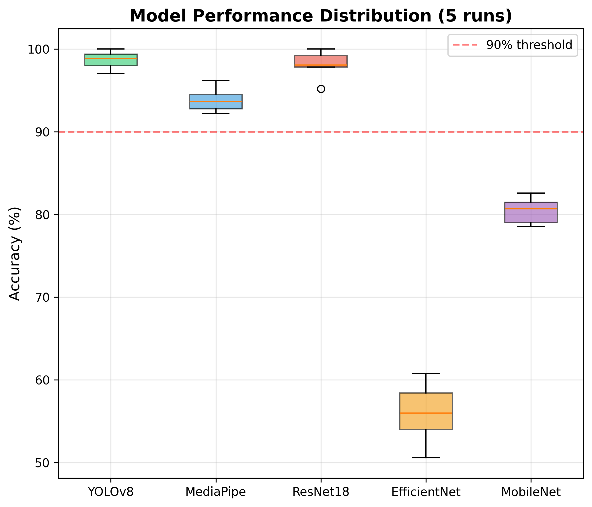
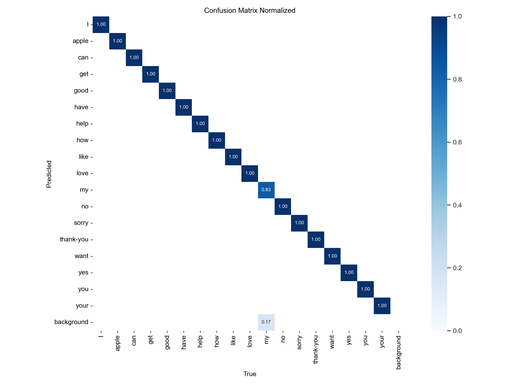
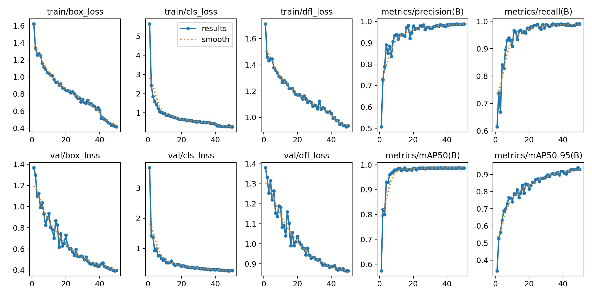

# Real-time ASL Teacher

🏆 **Winner — Best FYP Presentation** (Monash University, Final Year Project)
**98.80%** classification accuracy · **56.2 FPS** on consumer hardware (RTX 3050 Ti)

A real-time American Sign Language (ASL) recognition and education system. It combines
object detection (YOLOv8) with pose estimation (MediaPipe) to not just classify signs,
but to teach them — giving learners per-finger corrections and validating sentence
grammar as they sign.


## What it does

The system gives three levels of feedback, going beyond simple classification:

1. **Sign classification** — YOLOv8 identifies which of 18 ASL signs is being performed, in real time from a webcam feed.
2. **Biomechanical error diagnosis** — MediaPipe extracts 21 3D hand landmarks and compares them against a reference, generating specific corrections (e.g. *"bend index finger"*, *"extend pinky"*) rather than a pass/fail score.
3. **Grammar validation** — signed sentences are checked against ASL-specific grammar rules (Subject-Object-Verb ordering, time-first principle, WH-question placement) as they're assembled.

In the clip above, the system tracks the sign for *"have"*, scores the learner's hand
shape against a reference, and calls out specific finger corrections to improve
similarity in real time.

## Results

Five architectures were systematically compared for the classification stage, across
5 independent training runs each:

| Model | Mean Accuracy | Std Dev | Inference | Notes |
|---|---|---|---|---|
| **YOLOv8** | **98.81%** | ±0.68% | 17.8 ms (56.2 FPS) | Selected — highest accuracy *and* lowest variance |
| MediaPipe + Random Forest | 94.35% | ±0.88% | — | Strong, but 3.4× slower than YOLOv8 |
| ResNet18 | 93.93% | ±2.28% | — | High variance — sensitive to initialization |
| MobileNetV2 | 79.24% | ±0.90% | — | Smallest model (8.8 MB), viable for mobile |
| EfficientNet-B0 | 58.15% | ±2.10% | — | Underperformed — likely under-tuned for this dataset scale |

YOLOv8's advantage over the alternatives was statistically significant with large
effect sizes (vs. MediaPipe: *t*(4)=9.22, *p*<0.001, *d*=4.61; vs. ResNet18: *t*(4)=3.78,
*p*<0.05, *d*=1.89) — meaning the gap held up consistently across runs, not just as a
lucky single result.

<p>
  
  
</p>
<p>
  
  
</p>

## Architecture

```
Webcam frame
     │
     ├──► YOLOv8-small (640×640) ──► sign classification + bounding box
     │
     └──► MediaPipe Hands ──► 21 3D landmarks/hand ──► normalize (wrist-centered, palm-scaled)
                                        │
                                        ▼
                          Error Analysis Module ──► per-finger correction feedback
                                        │
                                        ▼
                          Grammar Validation Module ──► sentence-level ASL grammar rules
                                        │
                                        ▼
                          Real-time feedback UI (reference | user attempt | corrections)
```

YOLOv8 handles fast, robust classification; MediaPipe supplies the fine-grained
geometry needed for biomechanical feedback that a classifier alone can't give. Vision-
only input was chosen over sensor-based gloves for accessibility and cost, at the
expense of some sensitivity to lighting and occlusion.

## Limitations & lessons learned

Being upfront about what this project does *not* solve yet:

- **Small dataset.** Training used 1,105 images across 18 signs; the held-out test set
  was only **70 images (~4 per class)**. The reported 98.80% accuracy should be read with
  that caveat in mind — a larger test set (≥500 images) is needed to validate it with
  real statistical power. Cross-validation across 5 training runs (±0.68% std) helps
  confirm the result is stable, but doesn't substitute for more test data.
- **Limited vocabulary.** 18 signs, not ASL's full vocabulary (10,000+ signs). Scaling
  up would likely need hierarchical classification rather than a flat classifier.
- **Isolated signs, not continuous signing.** The system recognizes discrete signs
  with pause-based segmentation, not continuous/fluent ASL.
- **No non-manual markers.** ASL grammar relies heavily on facial expression and body
  language, which this system doesn't yet model — it currently reasons about hand
  position only.
- **Controlled conditions.** Evaluation was done under controlled lighting; performance
  in cluttered backgrounds or poor lighting is untested.
- **Two-handed signs are treated independently.** Hands aren't currently modeled
  relative to each other, which would matter for signs requiring precise hand-to-hand
  interaction.

Future directions from the final report: extending to the full ASL vocabulary via
transfer learning, adding facial-expression analysis for complete grammar feedback,
a mobile app, and a longitudinal study on retention.

## Repo structure

```
notebooks/            training, evaluation, and demo notebooks
notebooks/exploration/  early experiments (LSTM temporal modeling, How2Sign, Roboflow API)
config/               label list, normalized reference keypoints, YOLO data config
results/              per-model comparison stats, YOLOv8 training log (results.csv)
docs/                 final report, presentation slides, award certificate
assets/               demo GIF and figures used in this README
```

## Data & weights

Datasets are not bundled in this repo (see `config/data.yaml`-equivalent details in the
notebooks) — they draw from a private Roboflow workspace combining a custom-labeled set
with public ASL sign corpora ([MS-ASL](https://www.microsoft.com/en-us/research/project/ms-asl/),
[How2Sign](https://how2sign.github.io/)).

Trained weights (YOLOv8 `best.pt`, EfficientNet-B0) are attached to the
[latest release](../../releases/latest) rather than committed to the tree.

## Full writeup

- 📄 [Final report](docs/final-report.pdf) — full methodology, statistical analysis, and discussion
- 🖥️ [Presentation slides](docs/presentation-slides.pdf)
- 🏆 [Best FYP Presentation award](docs/best-presentation-award.pdf)
